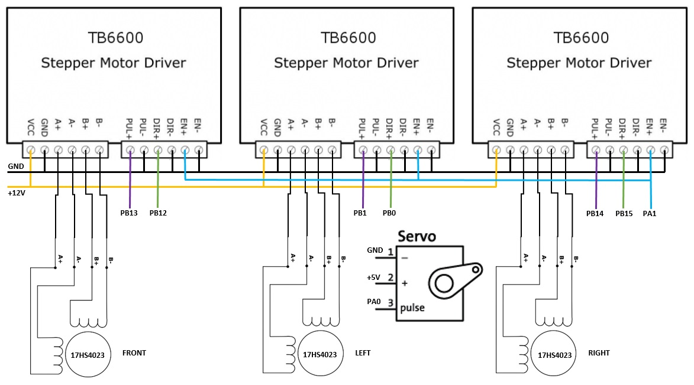
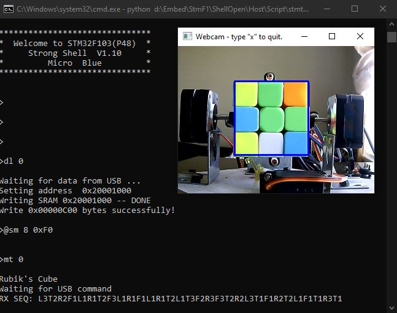

# Robotic Cube Solver #

This repo contains information on how to build a robotic cube solver using MCU STM32F103, stepper motors, servo and webcam.
Here is a video for a quick look.

https://user-images.githubusercontent.com/77249025/151071411-02db6310-b1c6-47c1-b3aa-7480b9b3eb15.mp4

## Hardware ##
The hardware platform is built with:
  - Host computer with webcam
  - TB6600 stepper motor driver x 3
  - 12HS4023 stepper motoir x 3
  - SG90 Servo x 1, or similar
  - STM32F103 MCU board. (For example, BluePill STM32F103)

The system hardware wiring is listed in the diagram below:

### Firmware ###
STM32F103 firmware utilized the [STM32F1](https://github.com/microxblue/stm32f1) project.
Please follow the instruction there to build Shell and run CmdCube Module. Once the module
is launched, the following key stroke in shell console can test the stepper and servo.
  - 'w': servo lift the arm
  - 'q': servo put down the arm
  - 'x': cube rotate 90 degree
  - 'y': cube rotate -90 degree
  - 'u': left face rotate 90 degree
  - 'v': left face rotate -90 degree
  - 's': right face rotate 90 degree
  - 't': right face rotate -90 degree

### Host Software ###
Python 3 script is used on host to scan the rublik's cube faces and find solutions for it.
It utilizes OPENCV to extract the rublik's cube colors, and use Kociemba two stage algorithm
to find a solution.
It is required to install some python modules:

    python -m pip install -r requirements.txt

To run the script:

    python cubesolver.py

### Setup ###
Please follow the following steps for setup:
  - Setup the hardware as shown in the diagram.
  - Mount rublk cube to the stepper motors.
    - White center piece should face towards left side stepper motor, and yellow center piece should face towards right side stepper motor
    - Orange center piece should face up
  - Install Servo so that:
    - It should block the middle column from rotating when the arm is up.
    - It should allow the free whole cube rotation when the arm is down.
  - Power up the stepper motor, servo and STM32 MCU.
  - Run CmdCube module:

        cd Module
        make run MOD=CmdCube
  - Launch cubesolver:

        python  cubesolver.py
  - Adjust cam position so that
    - The cube front face can exactly fit in the blue rectangle.
  - Issue commands as needed:
    - Press 'n' in the webcam window to scramble the cube.
    - Press 'd' in the webcam window to scan the cube faces.
    - Press 'm' in the webcam window to resolve the cube.
    - Press 'x' in the webcam window to quit.

